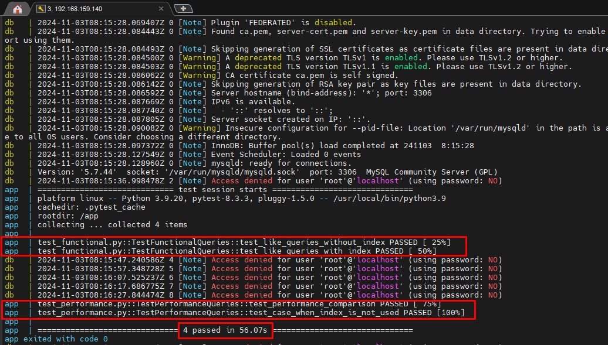

# int1_logspace

## Руководство запуска:

1. Склонируйте репу
   `git clone https://github.com/artias13/int1_logspace`
2. Создайте .env
3. Запустите проект
   `docker compose up --build`
4. Результаты тестов наблюдайте в выводе компоуз

## Описание файлов

### conftest.py

```
Этот файл содержит настройки и фикстуры для pytest. Основные моменты:
```

1. Загружает переменные окружения из файла .env
2. Определяет константы для подключения к базе данных
3. Создает фикстуру db_connection для подключения к MySQL
4. Использует load_dotenv для загрузки переменных окружения

### utils.py

```
Утилитный модуль с вспомогательными функциями:
```

1. execute_query - выполняет SQL-запрос
2. create_index - создает индекс в таблице
3. drop_index - удаляет индекс из таблицы

### test_functional.py

```
Тестовый модуль для проверки функциональности:
```

1. Тестирует запросы LIKE без и с индекса
2. Проверяет корректность результата запросов
3. Использует фикстуру db_connection для подключения к базе данных

### test_performance.py

```
Тестовый модуль для измерения производительности:
```

1. Сравнивает время выполнения запросов с и без индекса
2. Проверяет влияние индекса на скорость запросов
3. Использует более крупные наборы данных для точных сравнений
4. Включает повторное выполнение запросов для учета кэширования

## Результаты

### Рассмотрим результаты теста:

<p align="center">
    
</p>

### В соответствии со скриншотом выше, можем удостовериться, что:

1. В ходе выполнения функциональных тестов: <br>
   `Результаты запросов на одинаковых данных не отличаются в случаях, когда:`

- на колонке 'name' нет индекса в функции test_like_queries_without_index
- на колонке 'name' есть индекс в функции test_like_queries_with_index

2. В ходе выполнения перформанс тестов:<br>
   `Запросы с использованием индексов работают быстрее:`

- данный тест выполнен в функции test_performance_comparison и он проходит, однако разрешается некое отклонение в 1.5.<br>
  `Случай когда индекс не будет использоваться:`
- в похожем случае используем запрос LIKE с подстрокой в начале, тогда разница в выполнении не существенна
